@[TOC]([书生实战营] 入门岛1: Linux基础)

# 一、闯关任务

完成SSH连接与端口映射并运行`hello_world.py`

## 1.创建开发机器

进入InternStudio的[首页](https://studio.intern-ai.org.cn/console/dashboard)，并创建开发机

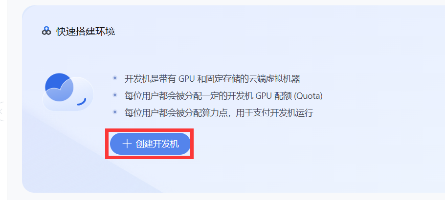

可以在这个界面设置**开发机名称**、**镜像类型**以及**资源配置**

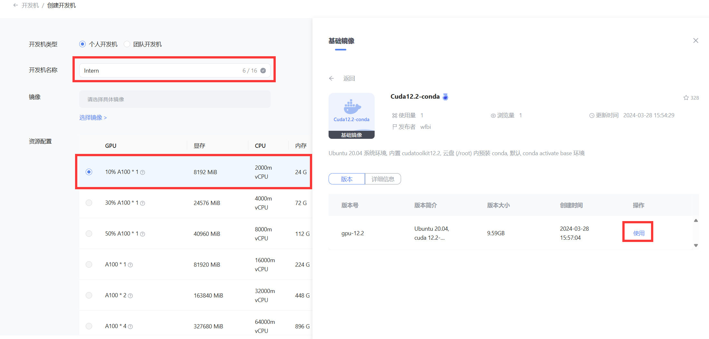

选择进入开发机并进行配置

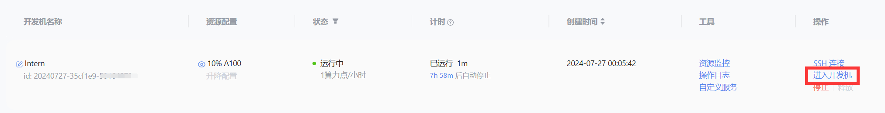

能够进入该界面后，说明配置成功

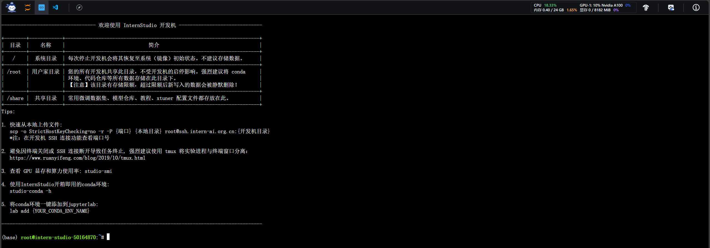

## 2.配置SSH远程连接

选择SSH连接后，可以获得**登录命令**和**密码**

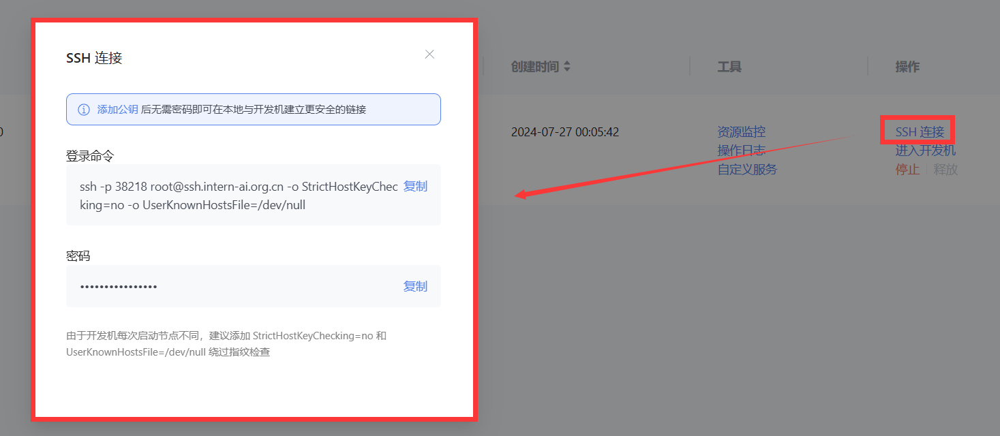

在本地终端中输入**登录命令**和**密码**即可登录，其中**密码**不会显示

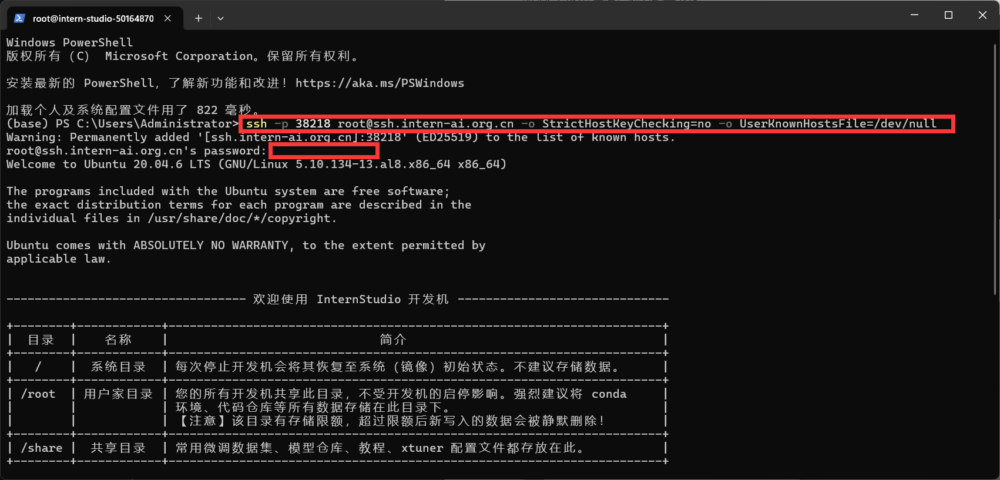

## 3.配置免密SSH登录

在本地终端中，使用RSA算法生成**密钥**：

```ssh
ssh-keygen -t rsa
```

输入命令后直接**回车**，密钥会生成在 `C:\Users\{your_username}\.ssh\id_rsa.pub` 文件中

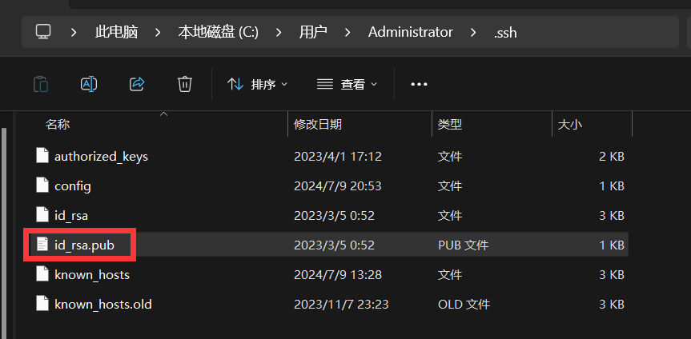

回到InternStudio的[首页 ](https://studio.intern-ai.org.cn/console/dashboard)，并选择**配置SSH**

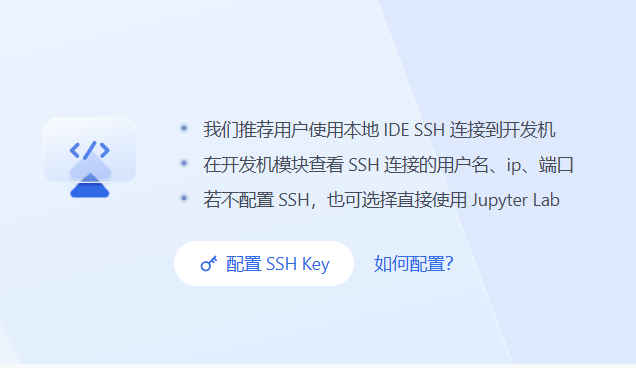

讲之前生成的`id_rsa.pub`的内容复制到**公钥**部分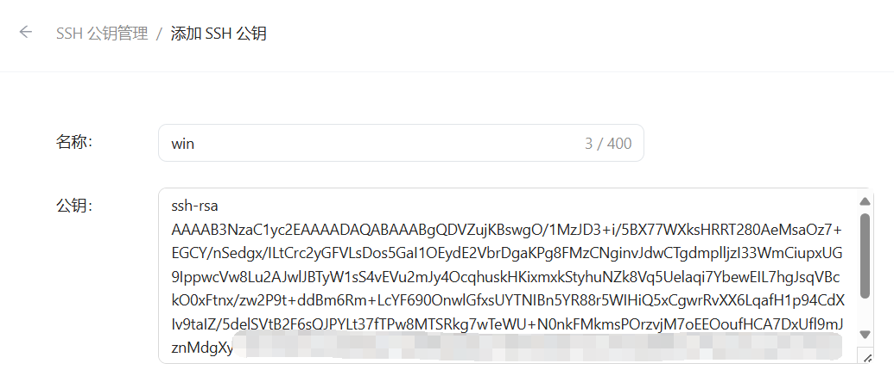

完成后就可以不输入密码直接登录了

## 4.配置vscode远程连接

安装remote ssh插件

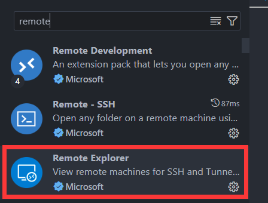

安装完成后使用之前的**ssh命令**进行连接

```shell
ssh -p 38218 root@ssh.intern-ai.org.cn -o StrictHostKeyChecking=no -o UserKnownHostsFile=/dev/null
```

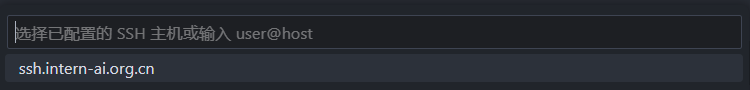

之后可以进入本地的vscode界面，之后可以使用本地的vscode进行代码开发

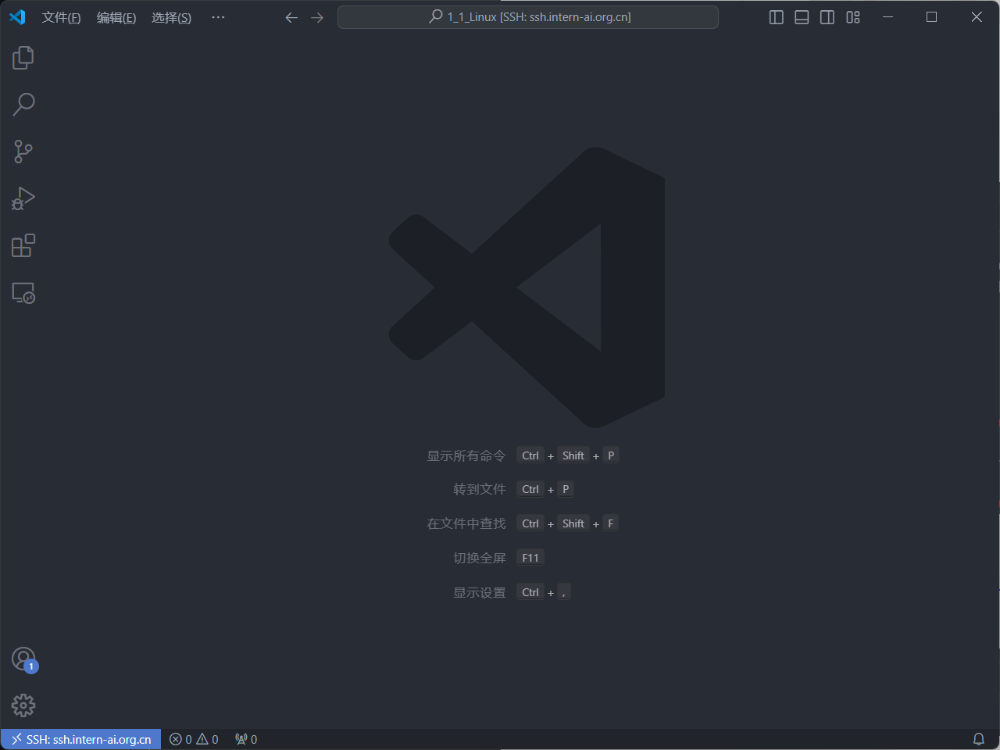

## 5.执行hello_word.py

在目录下创建`hello_word.py`文件

```python
import socket
import re
import gradio as gr
 
# 获取主机名
def get_hostname():
    hostname = socket.gethostname()
    match = re.search(r'-(\d+)$', hostname)
    name = match.group(1)
    
    return name
 
# 创建 Gradio 界面
with gr.Blocks(gr.themes.Soft()) as demo:
    html_code = f"""
            <p align="center">
            <a href="https://intern-ai.org.cn/home">
                
            </a>
            </p>
            <h1 style="text-align: center;">☁️ Welcome {get_hostname()} user, welcome to the ShuSheng LLM Practical Camp Course!</h1>
            <h2 style="text-align: center;">😀 Let’s go on a journey through ShuSheng Island together.</h2>
            <p align="center">
                <a href="https://github.com/InternLM/Tutorial/blob/camp3">
                    
                </a>
            </p>

            """
    gr.Markdown(html_code)

demo.launch()
```

在运行代码之前，需要先使用`pip install gradio==4.29.0`

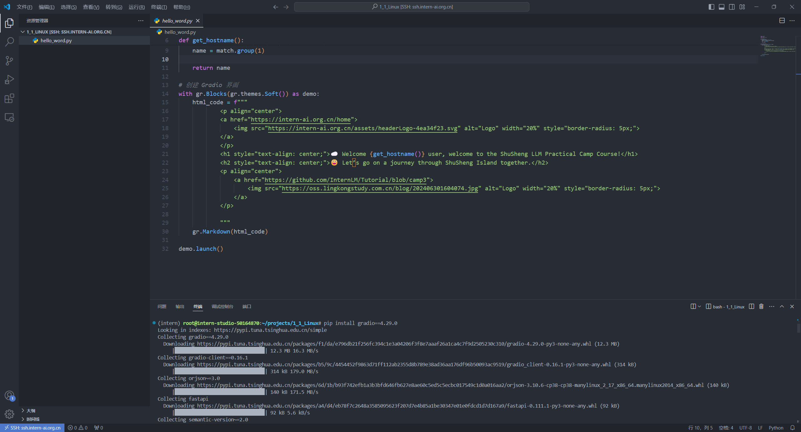

在终端中执行`python3 hello_world.py`后可以开启服务

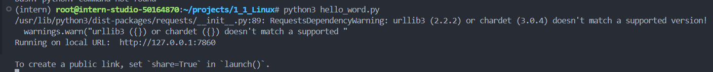

## 6.端口转发

运行上述vscode中会自动启动端口转发

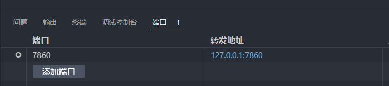

在浏览器输入`127.0.0.1:7860`，结果如下

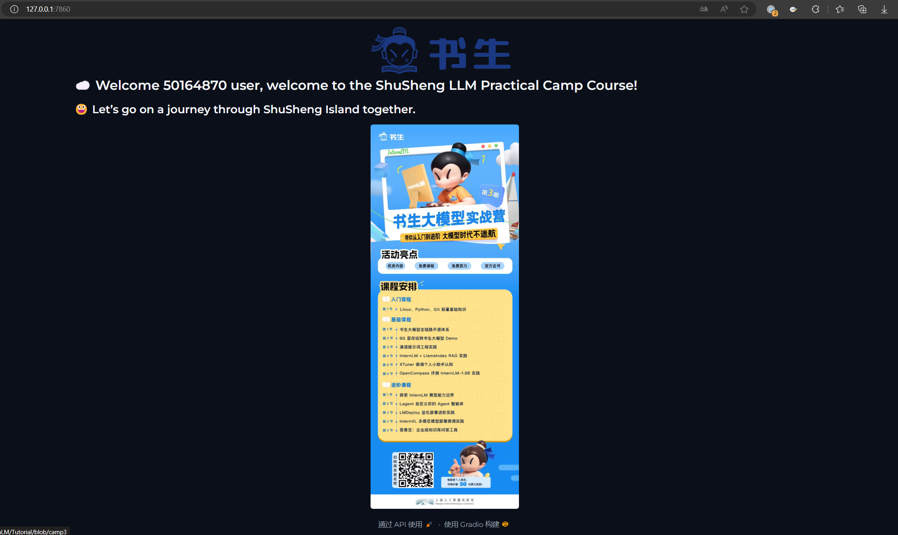
