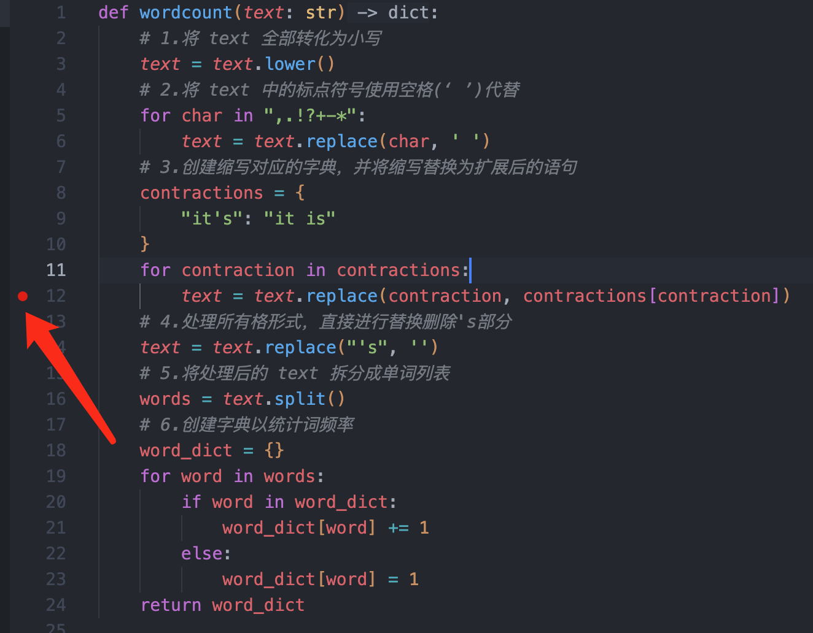
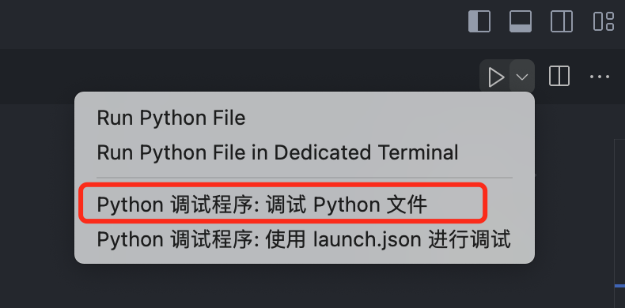
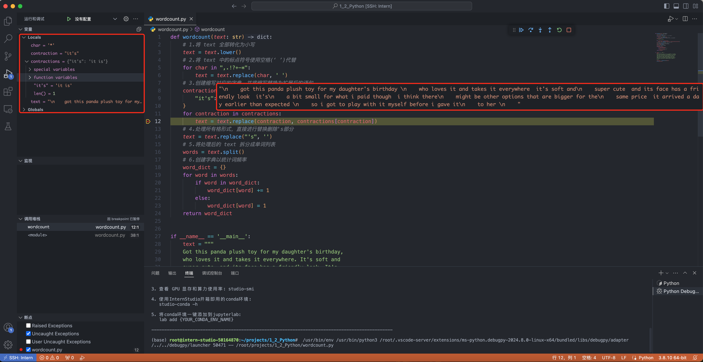

@[TOC]([书生实战营] 入门岛2: Python基础)

# 一、闯关任务：Python实现wordcount

实现一个wordcount函数，统计**英文字符串**中每个单词出现的次数。返回一个输入示例，key为单词，value为对应单词出现的次数。

**输入示例:**

```python
"""Hello world!  
This is an example.  
Word count is fun.  
Is it fun to count words?  
Yes, it is fun!"""
```

**输出示例:**

```python
{'hello': 1, 'world': 1, 'this': 1, 'is': 4, 'an': 1, 'example': 1, 'word': 1, 'count': 2, 'fun': 3, 'it': 2, 'to': 1, 'words': 1, 'yes': 1}
```

## 1.基础测试

按照官方的提示，需要实现分几步实现：单词小写转换，去除标点符号，分割字符，创建字典。具体的代码实现如下所示：

```python
def wordcount(text: str):
    # 1.将 text 全部转化为小写
    text = text.lower()
    # 2.将 text 中的标点符号使用空格(‘ ’)代替
    for char in ",.!?+-*":
        text = text.replace(char, ' ')
    # 3.将处理后的 text 拆分成单词列表
    words = text.split()
    # 4.创建字典以统计词频率
    word_dict = {}
    for word in words:
        if word in word_dict:
            word_dict[word] += 1
        else:
            word_dict[word] = 1
    return word_dict
```

定义主函数，并测试官方案例：

```python
if __name__ == '__main__':
    text = """
    Hello world!
    This is an example.  
    Word count is fun.  
    Is it fun to count words?  
    Yes, it is fun!
    """
    word_dict =  wordcount(text)
    print(word_dict)
```

得到结果如下：


```python
{'hello': 1, 'world': 1, 'this': 1, 'is': 4, 'an': 1, 'example': 1, 'word': 1, 'count': 2, 'fun': 3, 'it': 2, 'to': 1, 'words': 1, 'yes': 1}
```

## 2.进阶处理

在处理第二个案例时候会遇到**缩写**`It's`和**所有格**`daughter's`的情况，需要对`‘`字符进行特殊的处理

```python
text = """
Got this panda plush toy for my daughter's birthday,
who loves it and takes it everywhere. It's soft and
super cute, and its face has a friendly look. It's
a bit small for what I paid though. I think there
might be other options that are bigger for the
same price. It arrived a day earlier than expected,
so I got to play with it myself before I gave it
to her.
"""
```

仅针对这个案例，对于缩写使用替换的方式，进行补全。而对于所有格形式，则直接删除`'s'`部分，修改的代码如下：

```python
def wordcount(text: str):
    # 1.将 text 全部转化为小写
    text = text.lower()
    # 2.将 text 中的标点符号使用空格(‘ ’)代替
    for char in ",.!?+-*":
        text = text.replace(char, ' ')
    # 3.创建缩写对应的字典，并将缩写替换为扩展后的语句
    contractions = {
        "it's": "it is"
    }
    for contraction in contractions:
        text = text.replace(contraction, contractions[contraction])
    # 4.处理所有格形式，直接进行替换删除's部分
    text = text.replace("'s", '')
    # 5.将处理后的 text 拆分成单词列表
    words = text.split()
    # 6.创建字典以统计词频率
    word_dict = {}
    for word in words:
        if word in word_dict:
            word_dict[word] += 1
        else:
            word_dict[word] = 1
    return word_dict
```

在主函数中，将text修改为新的测试案例

```python
if __name__ == '__main__':
    text = """
    Got this panda plush toy for my daughter's birthday,
    who loves it and takes it everywhere. It's soft and
    super cute, and its face has a friendly look. It's
    a bit small for what I paid though. I think there
    might be other options that are bigger for the
    same price. It arrived a day earlier than expected,
    so I got to play with it myself before I gave it
    to her.
    """
    word_dict =  wordcount(text)
    print(word_dict)
```

运行程序得到的结果如下：


```python
{'got': 2, 'this': 1, 'panda': 1, 'plush': 1, 'toy': 1, 'for': 3, 'my': 1, 'daughter': 1, 'birthday': 1, 'who': 1, 'loves': 1, 'it': 7, 'and': 3, 'takes': 1, 'everywhere': 1, 'is': 2, 'soft': 1, 'super': 1, 'cute': 1, 'its': 1, 'face': 1, 'has': 1, 'a': 3, 'friendly': 1, 'look': 1, 'bit': 1, 'small': 1, 'what': 1, 'i': 4, 'paid': 1, 'though': 1, 'think': 1, 'there': 1, 'might': 1, 'be': 1, 'other': 1, 'options': 1, 'that': 1, 'are': 1, 'bigger': 1, 'the': 1, 'same': 1, 'price': 1, 'arrived': 1, 'day': 1, 'earlier': 1, 'than': 1, 'expected': 1, 'so': 1, 'to': 2, 'play': 1, 'with': 1, 'myself': 1, 'before': 1, 'gave': 1, 'her': 1}
```

可以看到`daughter's`和`it's`均进行了相应的处理

# 二、闯关任务：Vscode连接InternStudio debug

在进行测试中，需要在程序中打断点，监测程序运行过程中的输出。在vscode中可以在行号前打断点，会有**红色圆点**标识



在程序运行时，可以使用vscode自带的debug工具，对应简单的项目可以直接选择` Python 调试程序: 调试 Python 文件`



点击调试后，程序会在该断点处暂停，此时可以查看变量的值




