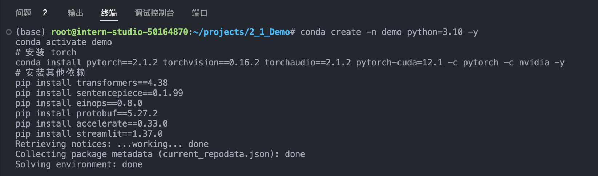
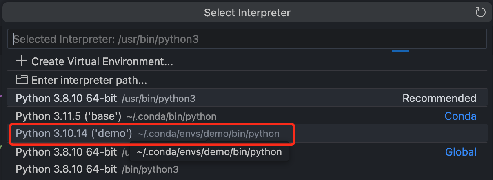
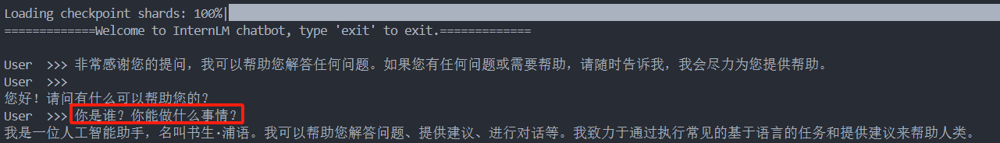
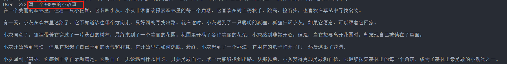
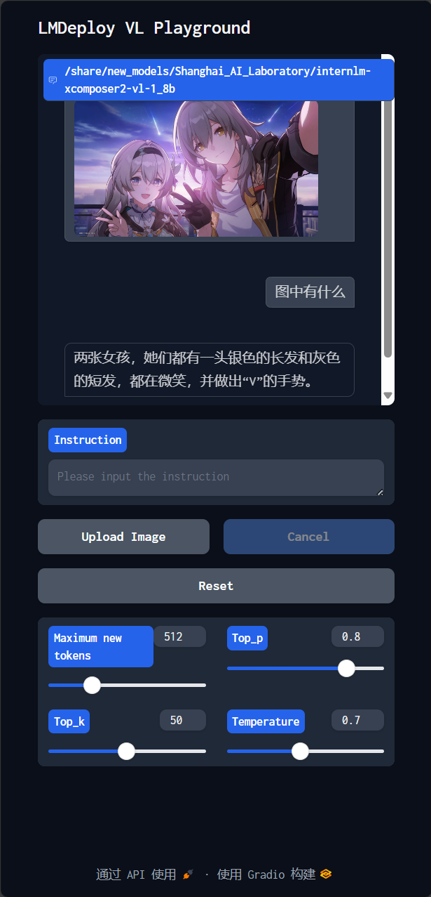
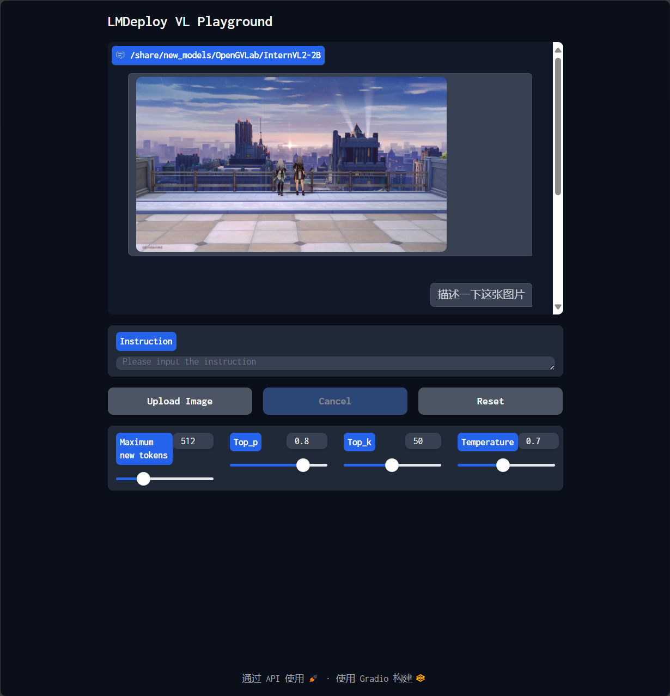
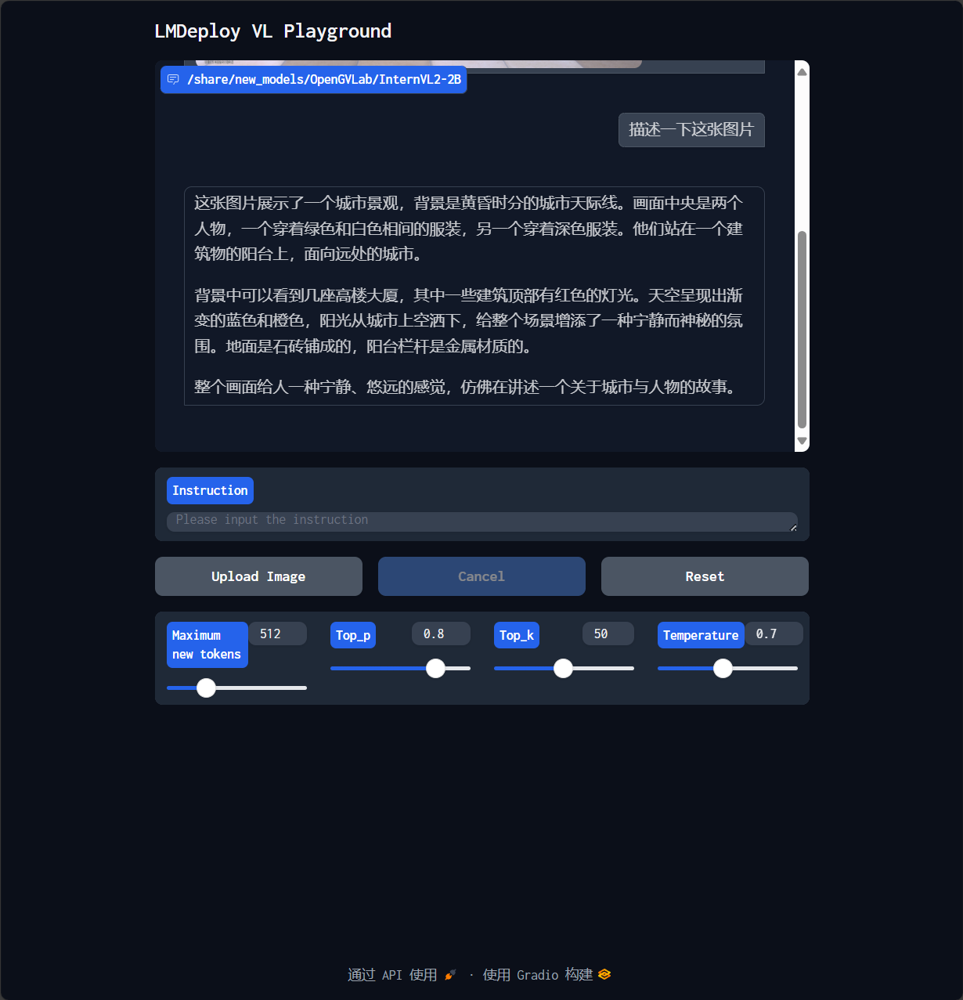

@[TOC]([书生实战营] 基础岛2: 8G 显存玩转书生大模型 Demo)

# 一、闯关任务：部署InternLM2-Chat-1.8B 

使用 `Cli Demo` 完成` InternLM2-Chat-1.8B `模型的部署，并生成 300 字小故事，记录复现过程并截图

## 1.环境配置

使用 `conda` 配置项目python环境

```shell
# 创建环境
conda create -n demo python=3.10 -y
# 激活环境
conda activate demo
# 安装 torch
conda install pytorch==2.1.2 torchvision==0.16.2 torchaudio==2.1.2 pytorch-cuda=12.1 -c pytorch -c nvidia -y
# 安装其他依赖
pip install transformers==4.38
pip install sentencepiece==0.1.99
pip install einops==0.8.0
pip install protobuf==5.27.2
pip install accelerate==0.33.0
pip install streamlit==1.37.0
```



后续在vscode中运行项目时，需要选择下python环境。选择后编辑代码会有对应包的**补全提示**，运行python程序时会切换对应的 **python路径**



## 2.创建项目

创建项目目录文件夹，并创建 `cli_demo.py` 文件

```shell
mkdir -p /root/projects/2_1_Demo
touch /root/projects/2_1_Demo/cli_demo.py
```

 `cli_demo.py` 文件内容如下：

```python
import torch
from transformers import AutoTokenizer, AutoModelForCausalLM


model_name_or_path = "/root/share/new_models/Shanghai_AI_Laboratory/internlm2-chat-1_8b"

tokenizer = AutoTokenizer.from_pretrained(model_name_or_path, trust_remote_code=True, device_map='cuda:0')
model = AutoModelForCausalLM.from_pretrained(model_name_or_path, trust_remote_code=True, torch_dtype=torch.bfloat16, device_map='cuda:0')
model = model.eval()

system_prompt = """You are an AI assistant whose name is InternLM (书生·浦语).
- InternLM (书生·浦语) is a conversational language model that is developed by Shanghai AI Laboratory (上海人工智能实验室). It is designed to be helpful, honest, and harmless.
- InternLM (书生·浦语) can understand and communicate fluently in the language chosen by the user such as English and 中文.
"""

messages = [(system_prompt, '')]

print("=============Welcome to InternLM chatbot, type 'exit' to exit.=============")

while True:
    input_text = input("\nUser  >>> ")
    input_text = input_text.replace(' ', '')
    if input_text == "exit":
        break

    length = 0
    for response, _ in model.stream_chat(tokenizer, input_text, messages):
        if response is not None:
            print(response[length:], flush=True, end="")
            length = len(response)
```

## 3.运行测试

运行`cli_demo.py`文件后可以在命令行进行问答测试

问题一：你是谁？你能做什么事情？



问题二：写一个300字的小故事




# 二、进阶任务：部署InternLM-XComposer2-VL-1.8B

使用 `LMDeploy` 完成` InternLM-XComposer2-VL-1.8B` 的部署，并完成一次图文理解对话，记录复现过程并截图

## 1.环境配置

和之前一样，需要在`conda`的`demo`环境中安装依赖包

```shell
conda activate demo
pip install lmdeploy[all]==0.5.1
pip install timm==1.0.7
```

## 2.运行测试

使用`LMDeploy` 启动一个与 `InternLM-XComposer2-VL-1.8B` 模型交互的 `Gradio` 服务

```shell
lmdeploy serve gradio /share/new_models/Shanghai_AI_Laboratory/internlm-xcomposer2-vl-1_8b --cache-max-entry-count 0.1
```

`vscode`中会自动开启端口转发，之后在浏览器中输入`localhost:6006` ，打开网页服务。在网页中上传图片后可以基于图片内容进行相应的问答




# 三、进阶任务：部署InternVL2-2B

使用` LMDeploy `完成` InternVL2-2B` 的部署，并完成一次图文理解对话，记录复现过程并截图

## 1.环境配置

和之前一样，需要在`conda`的`demo`环境中安装依赖包

```shell
conda activate demo
# 之前已经安装过可以不用重复安装
# pip install lmdeploy[all]==0.5.1
# pip install timm==1.0.7
```

## 2.运行测试

和之前部署 `InternLM-XComposer2-VL-1.8B` 类似，使用下面命令启动`InternVL2-2B`模型的 `Gradio`服务。（如果存在端口冲突，可以重新设置端口转发或者在终端中使用 `Ctrl+C` 停止之前的服务）



